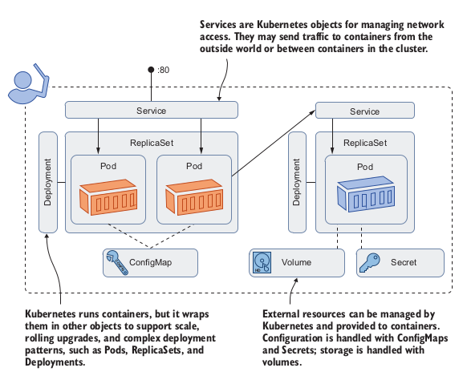

## Understanding Kubernetes
Kubernetes is a platform for running containers. It takes care of starting your con-
tainerized applications, rolling out updates, maintaining service levels, scaling to meet
demand, securing access, and much more. The two core concepts in Kubernetes are
the API, which you use to define your applications, and the cluster, which runs your
applications. A cluster is a set of individual servers that have all been configured with a
container runtime like Docker, and then joined into a single logical unit with Kuber-
netes. Figure 1.1 shows a high-level view of the cluster


The Kubernetes cluster is there to run your applications. You define your apps in
YAML files and send those files to the Kubernetes API. Kubernetes looks at what
you’re asking for in the YAML and compares it to what’s already running in the clus-
ter. It makes any changes it needs to get to the desired state, which could be updating
a configuration, removing containers, or creating new containers. Figure 1.2 shows the deployment process,
but without the nodes because we don’t really care about them at this level.


Those YAML files are properly called application manifests, because they’re a list
of all the components that go into shipping the app. Those components are Kuberne-
tes resources; they have proper names, too. Figure 1.4 takes the concepts from figure 1.3
and applies the correct Kubernetes resource names.



## Is this book for you?
The goal of this book is to fast-track your Kubernetes learning to the point where you
have confidence defining and running your own apps in Kubernetes, and you under-
stand what the path to production looks like. The best way to learn Kubernetes is to
practice, and if you follow all the examples in the chapters and work through the labs,
then you’ll have a solid understanding of all the most important pieces of Kubernetes
by the time you finish the book.

There
are two main Kubernetes certifications: Certified Kubernetes Application Developer
(CKAD) and Certified Kubernetes Administrator (CKA). This book covers about 80%
of the CKAD curriculum and about 50% of CKA.

## Creating your lab environment
The easiest option to run Kubernetes locally is Docker Desktop, which is a single
package that gives you Docker and Kubernetes and all the command-line tools.

### Download the book’s source code
```
git clone https://github.com/sixeyed/kiamol
```

### Install Docker Desktop
K3s works with Docker, so first, you should install Docker Community Edition. You
can check the full installation steps at https://rancher.com/docs/k3s/latest/en/
quick-start/, but this will get you up and running:
```
# install Docker:
curl -fsSL https://get.docker.com | sh
# install K3s:
curl -sfL https://get.k3s.io | sh -s - --docker --disable=traefik --write-
kubeconfig-mode=644
```
If you prefer to run your lab environment in a VM and you’re familiar with using
Vagrant to manage VMs, you can use the following Vagrant setup with Docker and K3s
found in the source repository for the book:
```
# from the root of the Kiamol repo:
cd ch01/vagrant-k3s
# provision the machine:
vagrant up
# and connect:
vagrant ssh
```

### Install the Kubernetes command-line tool
```
# OR Linux:
curl -Lo ./kubectl https://storage.googleapis.com/kubernetes-release/release/v1.18.8/bin/linux/amd64/kubectl
chmod +x ./kubectl
sudo mv ./kubectl /usr/local/bin/kubectl
```

### Run a single-node Kubernetes cluster in AWS
The managed Kubernetes service in AWS is called the Elastic Kubernetes Service (EKS). You can create a single-node EKS cluster —that you’ll be paying for that node and associated resources all the time it’s running.
```
# OR on Linux:
curl --silent --location
"https://github.com/weaveworks/eksctl/releases/download/latest/eksctl_$(uname
-s)_amd64.tar.gz" | tar xz -C /tmp
sudo mv /tmp/eksctl /usr/local/bin

# create a single node cluster with 2 CPU cores and 8GB RAM:
eksctl create cluster --name=kiamol --nodes=1 --node-type=t3.large
```

### Verify your cluster
```
kubectl get nodes
```
