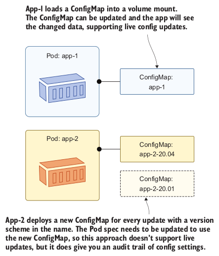
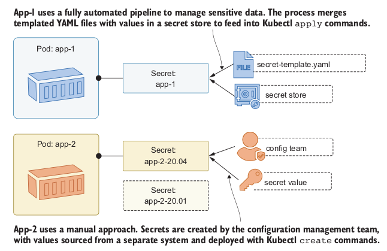

## How Kubernetes supplies configuration to apps
Environment variables are a core operating system feature in
Linux and Windows, and they can be set at the machine level so any app can
read them. They’re commonly used, and all containers have some set by the
operating system inside the container and by Kubernetes. Make sure your
Kubernetes lab is up and running.

```
# deploy a Pod using the sleep image with no extra configuration:
kubectl apply -f sleep/sleep.yaml

# wait for the Pod to be ready:
kubectl wait --for=condition=Ready pod -l app=sleep

# check some of the environment variables in the Pod container:
kubectl exec deploy/sleep -- printenv HOSTNAME KIAMOL_CHAPTER
```

### NOTE:
Printenv is a Linux command which shows the value of environment variables.
The `HOSTNAME` variable exists in all Pod containers and is set by Kubernetes
to be the Pod name. The `KIAMOL_CHAPTER` variable doesn't exist, so the
command exits with an error code.

Update the sleep Deployment with the new Pod spec from code
listing 4.1, adding an environment variable which is visible inside the Pod
container.

```
# update to the Deployment:
kubectl apply -f sleep/sleep-with-env.yaml

# check the same environment variables in the new Pod:
kubectl exec deploy/sleep -- printenv HOSTNAME KIAMOL_CHAPTER
```

Create a ConfigMap by specifying the data in the command,
then check the data and deploy the updated sleep app to use the ConfigMap.

```
# create a ConfigMap with data from the command line:
kubectl create configmap sleep-config-literal --from-literal=kiamol.section=`4.1`

# check the ConfigMap details:
kubectl get cm sleep-config-literal

# show the friendly description of the ConfigMap:
kubectl describe cm sleep-config-literal

# deploy the updated Pod spec from code listing 4.2:
kubectl apply -f sleep/sleep-with-configMap-env.yaml

# check the Kiamol environment variables:
kubectl exec deploy/sleep -- sh -c 'printenv | grep "^KIAMOL"'
```

## Storing and using configuration files in ConfigMaps
Create a new ConfigMap populated from the environment file in `ch04.env`, then deploy an update to the sleep app to use the new settings.

```
# load an environment variable into a new ConfigMap:
kubectl create configmap sleep-config-env-file --from-env-file=sleep/ch04.env

# check the details of the ConfigMap:
kubectl get cm sleep-config-env-file

# update the Pod to use the new ConfigMap:
kubectl apply -f sleep/sleep-with-configMap-env-file.yaml

# and check the values in the container:
kubectl exec deploy/sleep -- sh -c 'printenv | grep "^KIAMOL"'
```

Run the app without any additional configuration and check its
behavior.

```
# deploy the app with a service to access it:
kubectl apply -f todo-list/todo-web.yaml

# wait for the Pod to be ready:
kubectl wait --for=condition=Ready pod -l app=todo-web

# get the address of the app:
kubectl get svc todo-web -o jsonpath='http://{.status.loadBalancer.ingress[0].*}:8080'

# browse to the app and have a play around
# then try browsing to /config
# check the application logs:
kubectl logs -l app=todo-web
```

The new Pod spec references the ConfigMap, so that needs to be
created first by applying the YAML, then update the to-do app Deployment.

```
# create the JSON ConfigMap:
kubectl apply -f todo-list/configMaps/todo-web-config-dev.yaml

# update the app to use the ConfigMap:
kubectl apply -f todo-list/todo-web-dev.yaml

# refresh your web browser at the /config page for your service
```

## Surfacing configuration data from ConfigMaps
In this
example, the application loads its default settings from the file at `/app/appset-tings.json` , and then it looks for a file at `/app/config/config.json` that can contain
settings to override the defaults. The `/app/config` directory doesn’t exist in the con-tainer image; it is created and populated by Kubernetes.

The container filesystem appears as a single storage unit to the
application, but it has been built from the image and the ConfigMap. Those sources have different behaviors.

```
# show the default config file:
kubectl exec deploy/todo-web -- sh -c 'ls -l /app/app*.json'

# show the config file in the volume mount:
kubectl exec deploy/todo-web -- sh -c 'ls -l /app/config/*.json'

# check it really is read-only:
kubectl exec deploy/todo-web -- sh -c 'echo ch04 >> /app/config/config.json'
```

Update the app configuration with the ConfigMap from `todo-web-config-dev-with-logging.yaml`. That increases the logging level, so the same Pod will now start writing more log entries.

```
# check the current app logs:
kubectl logs -l app=todo-web

# deploy the updated ConfigMap:
kubectl apply -f todo-list/configMaps/todo-web-config-dev-with-logging.yaml

# wait for the config change to make it to the Pod:
sleep 120

# check the new setting:
kubectl exec deploy/todo-web -- sh -c 'ls -l /app/config/*.json'

# load a few pages from the site at your service IP address

# check the logs again:
kubectl logs -l app=todo-web
```

This is a broken Pod spec, where the ConfigMap is loaded into the /app directory
rather than the `/app/config` directory. The author probably intended this to merge
the directories, adding the JSON config files to the existing app directory. Instead it’s
going to wipe out the application binaries.

The Pod spec from code listing 4.9 removes all the app binaries,
so the replacement Pod won’t start. See what happens next.

```
# deploy the badly-configured Pod:
kubectl apply -f todo-list/todo-web-dev-broken.yaml

# browse back to the app and see how it looks

# check the app logs:
kubectl logs -l app=todo-web

# and check the Pod status:
kubectl get pods -l app=todo-web
```

Deploy the spec from `todo-web-dev-no-logging.yaml` which rolls out the
updated volume mount to fix the app but also ignores the logging JSON file
in the ConfigMap.

```
# apply the change:
kubectl apply -f todo-list/todo-web-dev-no-logging.yaml

# list the config folder contents:
kubectl exec deploy/todo-web -- sh -c 'ls /app/config'

# now browse to a few pages on the app

# check the logs:
kubectl logs -l app=todo-web

# and check the Pods:
kubectl get pods -l app=todo-web
```

## Configuring sensitive data with Secrets

You can create Secrets from a literal value, passing the key and
data into the Kubectl command. The retrieved data is Base64 encoded.

```
# now create a secret from a plain text literal:
kubectl create secret generic sleep-secret-literal --from-literal=secret=shh...

# show the friendly details of the secret:
kubectl describe secret sleep-secret-literal

# retrieve the encoded secret value:
kubectl get secret sleep-secret-literal -o jsonpath='{.data.secret}'

# and decode the data:
kubectl get secret sleep-secret-literal -o jsonpath='{.data.secret}' | base64 -d
```

Run a simple sleep Pod that uses the Secret as an environment
variable.
```
# update the sleep Deployment:
kubectl apply -f sleep/sleep-with-secret.yaml

# check the environment variable in the Pod:
kubectl exec deploy/sleep -- printenv KIAMOL_SECRET
```

In a production scenario you would keep the real data out of the YAML file, using
placeholders instead, and do some additional processing as part of your deploy-
ment—something like injecting the data into the placeholder from a GitHub secret.
Whichever approach you take, you need to remember that once the secret exists in
Kubernetes, it’s easy for anyone who has access to read the value.

Create a secret from the manifest in code listing 4.12 and check
the data.

```
# deploy the Secret:
kubectl apply -f todo-list/secrets/todo-db-secret-test.yaml

# check the data is encoded:
kubectl get secret todo-db-secret-test -o jsonpath='{.data.POSTGRES_PASSWORD}'

# and see what annotations are stored:
kubectl get secret todo-db-secret-test -o jsonpath='{.metadata.annotations}'
```

To use that Secret as the Postgres password, the image gives us a couple of options. We
can load the value into an environment variable called `POSTGRES_PASSWORD` —which is not ideal—or we can load it into a file and tell Postgres where to load the file by set-ting the `POSTGRES_PASSWORD_FILE` environment variable. Using a file means we can control access permissions at the volume level, which is how the database is configured in `todo-db-test.yaml`.

When this Pod is deployed, Kubernetes will load the value of the Secret item into a file at the path `/secrets/postgres_password`. That file will be set with 0400 permissions, which means it can be read by the container user but not by any other users. The environment variable is set for Postgres to load the password from that file, which the Postgres user has access to, so the database will start with credentials set from the Secret.

Deploy the database Pod, and verify the database starts correctly.
```
# deploy the YAML from code listing 4.13
kubectl apply -f todo-list/todo-db-test.yaml

# check the database logs:
kubectl logs -l app=todo-db --tail 1

# verify the password file permissions:
kubectl exec deploy/todo-db -- sh -c 'ls -l $(readlink -f /secrets/postgres_password)'
```

Run the to-do app so it uses the Postgres database for storage.

```
# the ConfigMap configures the app to use Postgres:
kubectl apply -f todo-list/configMaps/todo-web-config-test.yaml

# the Secret contains the credentials to connect to Postgres:
kubectl apply -f todo-list/secrets/todo-web-secret-test.yaml

# the Deployment Pod spec uses the ConfigMap and Secret:
kubectl apply -f todo-list/todo-web-test.yaml

# check the database credentials are set in the app:
kubectl exec deploy/todo-web-test -- cat /app/secrets/secrets.json

# browse to the app and add some items
```

## Managing app configuration in Kubernetes



An alternative is a fully automated deployment, where ConfigMaps and Secrets are
created from YAML templates in source control. The YAML files contain placeholders
instead of sensitive data, and the deployment process replaces them with real values
from a secure store like Azure KeyVault before applying them.



## Lab
If you’re reeling from all the options Kubernetes gives you to configure apps, this lab
is going to help. In practice, your apps will have their own ideas about config manage-
ment, and you’ll need to model your Kubernetes Deployments to suit the way your
apps expect to be configured. That’s what you need to do in this lab with a simple app
called Adminer. Here we go:
- Adminer is a web UI for administering SQL databases, and it can be a handy
tool to run in Kubernetes when you’re troubleshooting database issues.
- Start by deploying the YAML files in the `ch04/lab/postgres` folder, then
deploy the `ch04/lab/adminer.yaml` file to run Adminer in its basic state.
- Find the external IP for your Adminer service and browse to port `8082`. Note
that you need to specify a database server, and that the UI design is stuck in the
1990s. You can confirm the connection to Postgres by using postgres as the
database name, username and password.
- Your job is to create and use some config objects in the Adminer Deployment so
that the database server name defaults to the lab’s Postgres service, and the UI
uses the much nicer design called price.
- You can set the default database server in an environment variable called
`ADMINER_DEFAULT_SERVER` . Let’s call this sensitive data, so it should use a Secret.
- The UI design is set in the environment variable `ADMINER_DESIGN` —that’s not
sensitive so a ConfigMap will do nicely.